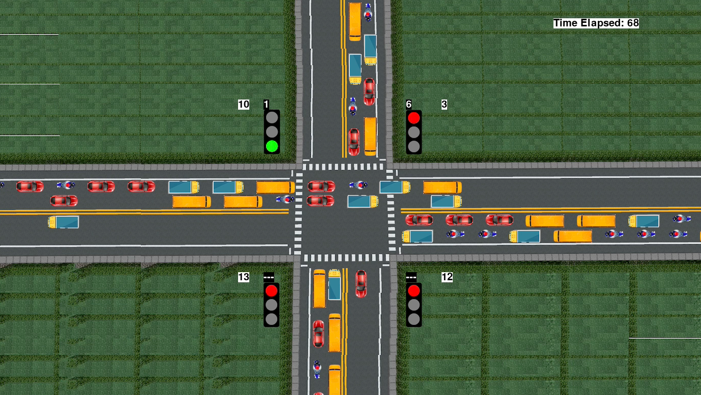

<p align="center">
 
</p>

<h1 align="center">Traffic Intersection Simulation with Stats</h1>

<div align="center">

[](https://www.python.org/downloads/)
[](https://opensource.org/licenses/MIT)

<h4>A simulation developed from scratch using Pygame to simulate the movement of vehicles across a traffic intersection having traffic lights with a timer. Some statistics and analytical features added to the simulation to help in Modelling problems, Data Analysis tasks, and AI applications.</h4>

</div>

-----------------------------------------
### Features added:

* `Vehicle counts` - 
* `Vehicle counts` -
* `Vehicle counts` -
* `Vehicle counts` -
* `Vehicle counts` -

<p align="center">
 
</p>

------------------------------------------
### Demo

The video below shows the final output of the simulation.

<p align="center">
    
</p>

------------------------------------------
### Prerequisites

[Python 3.1+](https://www.python.org/downloads/)

------------------------------------------
### Installation

 * Step I: Clone the Repository
```sh
      $ git clone https://github.com/mihir-m-gandhi/Traffic-Intersection-Simulation-with-Stats
```
  * Step II: Install the required packages
```sh
      # On the terminal, move into Traffic-Intersection-Simulation-with-Stats directory
      $ cd Traffic-Intersection-Simulation-with-Stats
      $ pip install pygame
```
* Step III: Run the code
```sh
      # To run simulation
      $ python simulation.py
```

------------------------------------------
### Author

Mihir Gandhi - [mihir-m-gandhi](https://github.com/mihir-m-gandhi)

------------------------------------------
### License
This project is licensed under the MIT - see the [LICENSE](./LICENSE) file for details.
